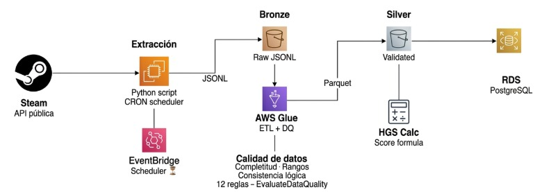

# 🎮 Steam Hidden Gem Score

A data engineering pipeline that automatically identifies underrated games on Steam using a weighted scoring index. Built on AWS with a Medallion architecture (Bronze → Silver → Gold).

---

## Why this project?

Steam has over 50,000 games available, but most users only discover titles that are already popular. High-quality games with small communities stay invisible — not because they're bad, but because recommendation algorithms favor games that are already mainstream.

This project answers three concrete questions to help a marketing team surface those overlooked titles and promote them before they go mainstream:

- **Which games have high perceived quality but low visibility?** — Identifying candidates worth promoting based on review sentiment vs. exposure gap.
- **Which genres concentrate the most hidden gems?** — Understanding where underrated games cluster to focus discovery efforts.
- **Which games are rising in score between extractions?** — Detecting games gaining organic traction early, before they lose their "hidden" status.
  The output is a continuously updated ranking that a marketing team can use to build a _"Hidden Gems"_ section or a personalized recommendations tab on Steam.

## What is it?

Most Steam users only discover games that are already popular. This project builds a **Hidden Gem Score (HGS)** — an objective, reproducible index that ranks games by their combination of perceived quality, low visibility, and accessible price. The result is an actionable list of overlooked titles that a marketing team could use to promote before they go mainstream.

### Score Formula

```
HGS = (positive_review_pct × 0.50) + (obscurity_score × 0.30) + (price_score × 0.20)
```

| Dimension         | Weight | Logic                                                    |
| ----------------- | ------ | -------------------------------------------------------- |
| Perceived quality | 50%    | % of positive reviews out of total                       |
| Obscurity         | 30%    | Inversely proportional to total review count             |
| Accessible price  | 20%    | Inversely proportional to price (free-to-play supported) |

---

## Architecture



**Tech Stack:**

- **Languages:** Python 3.10
- **APIs:** SteamSpy API, Steam Store API
- **AWS Services:**
  - Orchestration: EventBridge Scheduler
  - Storage: Amazon S3 (Bronze / Silver / Gold layers)
  - ETL & Data Quality: AWS Glue, `EvaluateDataQuality` (12 rules)
  - Database: Amazon RDS PostgreSQL
  - Security: AWS IAM (least privilege roles)

---

## Project Structure

```
steam-hidden-gem-score/
├── deploy/
│   └── Deploy.pdf                     # Deployment configuration and setup
│
├── docs/
│   ├── DocumentacionArquitectura.pdf # System architecture documentation
│   ├── DocumentacionFuncional.pdf    # Functional requirements
│   ├── DocumentacionTecnica.pdf      # Technical implementation details
│   ├── RFP.pdf                       # Request for Proposal
│   └── SOW.pdf                       # Statement of Work
│
├── img/
│   ├── EC2-Instances.png             # AWS EC2 screenshots
│   ├── Glue-Silver.png               # AWS Glue processing layer
│   ├── RDS-Gold.png                  # PostgreSQL Gold layer
│   ├── S3-Bucket.png                 # S3 bucket configuration
│   ├── S3-Buckets.png                # Multiple S3 buckets architecture
│   └── architecture.jpeg             # Overall system architecture diagram
│
├── ppt/
│   └── SteamHiddenGemScore.pdf       # Project presentation
│
├── src/
│   ├── extract.py                    # Steam API extraction pipeline
│   ├── glue_job.py                   # AWS Glue ETL process
│   ├── hgs_calc.py                   # Hidden Gem Score calculation
│   └── schema.sql                    # PostgreSQL schema definitions
│
├── tests/
│   └── test_extract.py               # Unit tests for extraction module
│
├── .gitattributes
├── .gitignore
└── README.md
```

---

## Pipeline Flow

1. **Extraction** — Python script queries SteamSpy and Steam Store APIs, writes raw JSONL to S3 Bronze partitioned by date (`bronze/YYYY-MM-DD/games.jsonl`).
2. **ETL + Quality** — AWS Glue job (`TEST-GLUE-JOB-DATA-QUALITY`) reads Bronze, applies 12 data quality rules (completeness, valid ranges, logical consistency), and writes validated data to S3 Silver in Parquet/Snappy format.
3. **Scoring** — HGS formula is applied to Silver data. Free-to-play games (price = 0) are fully supported and receive the maximum price score.
4. **Gold Load** — Scored data is loaded into RDS PostgreSQL via JDBC for querying and dashboard consumption.

---

## Data Quality Rules (AWS Glue EvaluateDataQuality)

12 rules across three categories:

- **Completeness** — `app_id`, `total_reviews`, `positive_reviews`, and `price` must be present.
- **Valid ranges** — Positive review percentage between 0 and 100; price ≥ 0.
- **Logical consistency** — `positive_reviews` ≤ `total_reviews`; games with 0 total reviews are excluded from scoring.

Only records that pass all 12 rules advance to Silver and Gold.

---

## Setup & Execution

### Prerequisites

- AWS account with S3, Glue, RDS, EventBridge, and CloudWatch configured
- Python 3.10+
- AWS CLI configured (`aws configure`)

---

## License

Academic project. Not affiliated with Valve Corporation or Steam.
